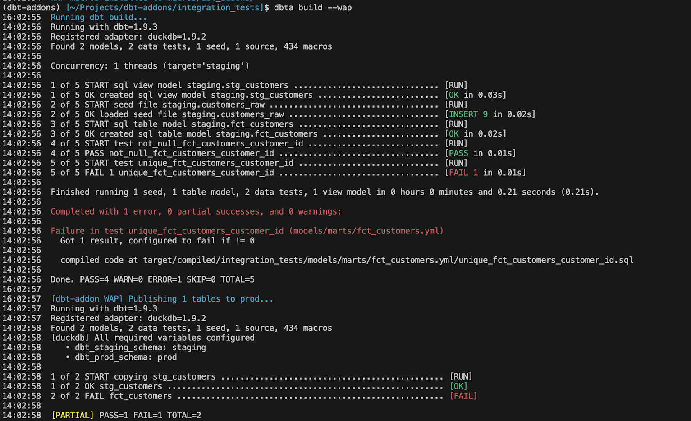

# WAP Concept


## The problem

When dbt rebuilds a model, it replaces the table in-place. If the run fails halfway through, or if a data quality test catches an issue after the fact, bad data has already reached production.

## The solution: Write-Audit-Publish (WAP)

WAP solves this by separating the build schema from the production (or exposition) schema:

```
┌─────────────────────────────────────────────────────┐
│                    staging schema                   │
│                                                     │
│   dbt run/build → models materialized here first    │
│   dbt tests     → run against staging               │
└──────────────────────┬──────────────────────────────┘
                       │ tests pass
                       ▼
┌─────────────────────────────────────────────────────┐
│                     prod schema                     │
│                                                     │
│   wap_deploy → atomic clone/copy from staging       │
│   consumers  → always see last known-good state     │
└─────────────────────────────────────────────────────┘
```

If any test fails, the publish step is skipped for that model. Production is never touched, which means no bad data are discovered by users.


## Per-model granularity

WAP operates at the model level.

For instance, if `stg_customers` passes all its tests but `fct_customers` fails, only `stg_customers` is promoted.

The CLI reports which models were promoted and which were skipped. For instance:


